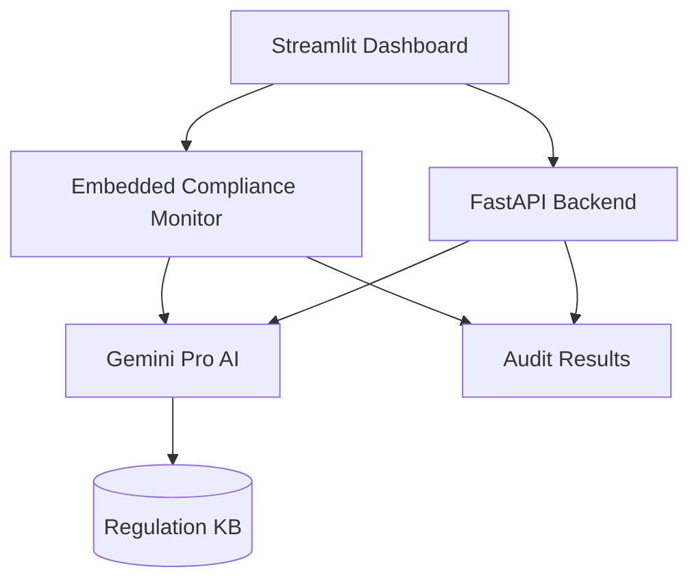

# 🛡️ Gemini Compliance Monitor - AI-Powered Regulatory Compliance System

## 🏆 Hackathon Project Submission

### Problem Statement
Companies struggle to keep up with global digital regulations (GDPR, CCPA, DMA, AI Act). Manual compliance auditing takes 200+ hours monthly, with potential fines up to 6% of global revenue for violations.

### Solution
A real-time AI-powered compliance monitoring system that:
- Automatically reads and interprets regulations
- Audits company systems against multiple regulations simultaneously
- Provides actionable fix suggestions
- Estimates potential fines and risk levels
- Offers real-time monitoring dashboard

### ⚙️ Core Components
- **Regulation Parser**: Uses Gemini Pro to convert unstructured regulatory PDF/Text into searchable JSON schemas.
- **System Auditor**: Cross-references company technical stacks against regulatory requirements to find gaps.
- **Fix Suggester**: Generates step-by-step remediation plans, including estimated time and cost for developers.
- **Compliance Monitor**: The central engine that orchestrates analysis and maintains compliance history.

### 🏗️ Technical Architecture


### 📦 Installation

```bash
# Clone repository
git clone https://github.com/yourusername/gemini-compliance-hackathon.git
cd gemini-compliance-hackathon

# Install dependencies
pip install -r requirements.txt

# Setup environment variables
cp .env.example .env
# Edit .env and add your Gemini API key

---

## 🚢 Deployment

This repository includes artifacts to run and deploy the project in development and production environments.

### Docker (recommended)
- Build API image:
  ```bash
  docker build -f Dockerfile.api -t gemini-compliance-api .
  ```
- Build dashboard image:
  ```bash
  docker build -f Dockerfile.dashboard -t gemini-compliance-dashboard .
  ```
- Or run both together with Docker Compose:
  ```bash
  docker-compose up --build
  ```

### Cloud / Production
- Use the `Dockerfile.api` image for the API and a managed container service (Cloud Run, ECS, AKS, etc.).
- Disable `--reload` for production (edit `CMD` in `Dockerfile.api` or override at runtime).
- Store secrets (e.g., `GEMINI_API_KEY`) in your provider's secrets manager or CI secrets.

### Development
- Install dev dependencies:
  ```bash
  make install-dev
  ```
- Run tests:
  ```bash
  make test
  ```
- Lint and format code:
  ```bash
  make lint
  make format
  ```

### CI/CD
- A GitHub Actions workflow is provided at `.github/workflows/ci.yml` to run tests and build images on pushes and pull requests.
- A dedicated **publish** workflow `.github/workflows/publish.yml` will build and push Docker images to GitHub Container Registry (GHCR) when you publish a release or push a `v*.*.*` tag.
  - Images are pushed as `ghcr.io/<owner>/gemini-compliance-api:TAG` and `ghcr.io/<owner>/gemini-compliance-dashboard:TAG`.
  - GHCR publishing uses the built-in `GITHUB_TOKEN`; no additional secrets are required for the registry write permission (ensure `packages: write` is enabled for the token if using custom tokens).
- If you prefer Docker Hub, set up `DOCKERHUB_USERNAME` and `DOCKERHUB_TOKEN` as repo secrets and update the workflow to login to Docker Hub instead.

**Quick commands**
- Build and push locally using the Makefile:
  ```bash
  make docker-build
  docker login ghcr.io
  docker tag gemini-compliance-api:latest ghcr.io/<owner>/gemini-compliance-api:latest
  docker push ghcr.io/<owner>/gemini-compliance-api:latest
  ```


### Notes
- Make sure to set `GEMINI_API_KEY` in the environment when running in non-mock mode.
- For Windows users, consider using WSL2 + Docker Desktop for best compatibility.

### Required environment variables & repo secrets
- `.env` variables (used at runtime)
  - `GEMINI_API_KEY` — (optional for local dev; required to use the Gemini client in production)
  - `API_HOST`, `API_PORT` — optional overrides for API server host/port
- GitHub Actions / CI secrets
  - `GITHUB_TOKEN` — used by the publish workflow to push images to GHCR (automatically available in Actions)
  - `DOCKERHUB_USERNAME` / `DOCKERHUB_TOKEN` — if you choose to publish to Docker Hub instead (create repository secrets)

